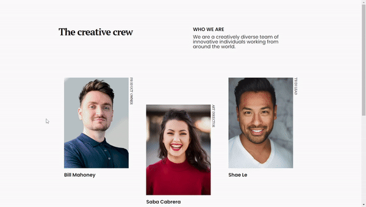

# DevChallenges - My Team Page

My team page is the presentation page of a team made up of several professionals involved in the development of web applications.

This project was developed as a challenge proposed by the devChallenges website as a way of consolidating knowledge in building responsive pages (beginner level).

## Overview

### Preview

### Links

- Live Site URL: [Live Site](https://rwsaraujo.github.io/404-not-found/)

## My process

### Built with

- HTML
- CSS Flex Box
- CSS Grid Layout
- JavaScript

## Author

- GitHub - [rwsaraujo](https://github.com/rwsaraujo)
